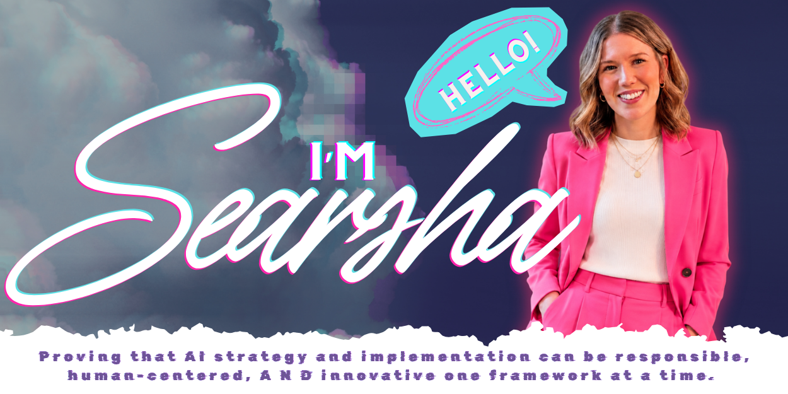
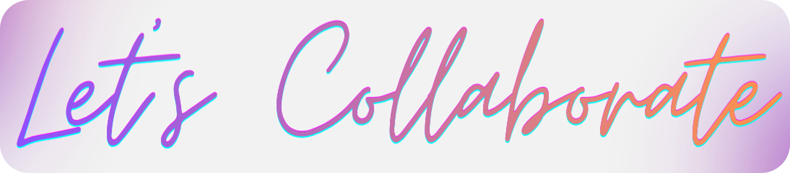

  

### CREATIVE × STRATEGIST × BUILDER

**I’m drawn to the space where big ideas meet real execution.**

I think creatively, work strategically, and love building things that make emerging technology feel more useful, more responsible, and more human.

My work centers on AI strategy, innovation, business transformation, and human-centered adoption, with a particular interest in how organizations can use AI thoughtfully without losing the people, judgment, creativity, and purpose that make the work matter.

**Creativity finds the possibility. Strategy gives it direction. Building makes it real.**

---

### CREATIVITY IS INTELLIGENCE HAVING FUN. 
— Albert Einstein

 

**Albert hit the nail on the head.**  
I’ve never believed creativity and strategy are mutually exclusive. I believe the best ideas happen when the two work together.  
*If you’re not having at fun while figuring out what’s possible, you're probably doing it wrong.*
 
### Creativity sees what could be & strategy figures out how to make it real.
 
SOME OF MY BEST STRATEGIC THINKING STARTS WITH CURIOSITY:

*Could technology make this easier, smarter, more accessible, or simply better?*
*What if we did it differently?*  
*Why does it have to work this way?*  
*What are we missing?*  

**Then comes the part I love just as much:** figuring out how to turn that possibility into something people can actually use.

---

### WHERE MY BRAIN LIVES

<table>
<tr>
<td width="33%" valign="top">

### CREATE

I naturally see possibilities, connections, and new ways of approaching problems.

* Creative problem solving
* Innovation
* Experience design
* Learning innovation
* Emerging ideas
* Seeing around corners

</td>

<td width="33%" valign="top">

### STRATEGIZE

Ideas become meaningful when they connect to purpose, priorities, and measurable value.

* AI strategy
* Business transformation
* Responsible AI
* Portfolio strategy
* Organizational readiness
* Strategic partnerships

</td>

<td width="33%" valign="top">

### BUILD

I’m not interested in leaving good ideas sitting on a whiteboard.

* Framework development
* Program design
* Prompt & context engineering
* Workflow redesign
* Implementation strategy
* Scalable solutions

</td>
</tr>
</table>

 

### Creativity finds the possibility.

### Strategy gives it direction.

### Building makes it real.

### ENTER AI STAGE LEFT

I care deeply about AI, but not because I think AI should be everywhere.

**I care about understanding where it can genuinely make something better**.

Better decisions. 
Better learning. 
Better workflows. 
Better access. 
Better experiences. 
Better ways to spend time & energy.

**I care just as much about the questions surrounding the technology:**  
Who benefits? 
What could go wrong? 
What information should the system have access to? 
Where should human judgment remain? 
How do we build trust? 
How do we measure whether it actually created value? 

  
**Responsible AI should not be something we bolt on A F T E R innovation.  
It should be part of how we innovate from I N C E P T I O N.**

---

### MY AI PHILOSOPHY

### AI gives us the key to doors we never knew existed.

**But the key does not decide what happens next.**

The real opportunity is deciding which doors are worth opening, turning the key with intention, and using human judgment, creativity, and strategy to decide what we build on the other side.

 

That is why I believe the future of AI should remain fundamentally *human-centered*.

AI can expand what is possible.

**People MUST provide the purpose, judgment, creativity, context, empathy, & accountability  
that determine IF *possibility* SHOULD BECOME *progress.***

---

### What I'm exploring

Right now, I’m especially interested in:

`AI Strategy`   `Responsible AI`   `Human-Centered AI`

`Prompt & Context Engineering`   `Business Transformation`

`Workforce Innovation`   `Learning Ecosystems`

`Organizational Readiness`   `Emerging Technology`

`Human-in-the-Loop Design`   `AI Governance`

 

But underneath all of those topics is one bigger question:

> **How do we help organizations become good at adapting to AI, not simply good at implementing the AI tools that exist today?**

Because the tools will change.

**The ability to think, learn, evaluate, create, adapt, and lead through change is what lasts.**

---

### What I'm Building

GitHub is becoming my creative lab, a place to turn the ideas I’m exploring into practical frameworks, tools, examples, and experiments.

<table>
<tr>
<td width="50%" valign="top">

### AI Strategy Toolkit

A growing collection of practical tools for moving from:

**"We should do something with AI."**

to:

**"We understand the opportunity, our readiness, the risk, and what we should do next."**

Includes work around:

* AI readiness
* Use-case prioritization
* Responsible implementation
* Human oversight
* Organizational transformation

**[EXPLORE THE TOOLKIT →](https://github.com/searsha/ai-strategy-toolkit)**

</td>

<td width="50%" valign="top">

### Prompt + Context Engineering

An exploration of what makes AI interactions actually work.

Because good AI output is rarely about discovering one magical prompt.

It comes from intentionally designing:

* Instructions
* Context
* Constraints
* Information architecture
* Evaluation
* Human review
 
 

**[EXPLORE THE PROJECT →](https://github.com/searsha/prompt-context-engineering)**

</td>
</tr>
</table>

 

### WHAT I BELIEVE

### AI should make people more capable, not less important.

Human judgment is not a design flaw we need to automate away.

### Responsible does not have to mean boring.

Guardrails, governance, creativity, experimentation, and innovation can coexist.

### Strategy without execution is just a really nice idea.

I love vision. I also want to know who is doing what on Monday morning.

### Creativity belongs in serious rooms.

Some of the most valuable breakthroughs begin because someone was willing to ask a question that sounded a little different.

### Technology should solve problems, not become one.

If the solution creates more friction than the problem it was designed to fix, we probably need to rethink the solution.

### People are part of the system.

Technology, process, culture, skills, trust, communication, incentives, and leadership all influence whether transformation actually works.

 

---

### A LITTLE LESS "AI FOR AI'S SAKE."

### A little more curiosity.

### A little more creativity.

### A lot more intention.

 

This space will keep evolving as I build, experiment, refine ideas, and share more of the work I’m exploring across AI, strategy, innovation, and transformation.

I’m not trying to make AI look more complicated.

**I’m interested in making complex technology feel more understandable, more useful, more responsible — and maybe a little more fun.**

 

**Have an interesting problem, idea, or opportunity?**

  

 

